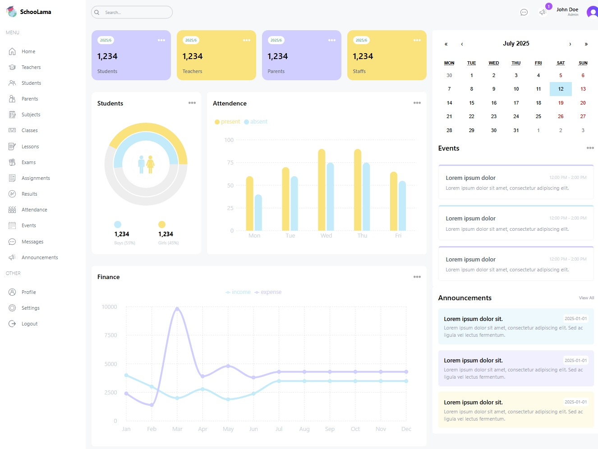

# Next.js School Management Dashboard (in progress)

A modern **Next.js** and **TypeScript** web application designed to revolutionize school administration. The dashboard offers comprehensive tools for educators and administrators with:

## ✨ Key Features

- **User Management**: Full CRUD operations for students, teachers and parents.
- **Academic Tracking**:
  - Exam and assignment management
  - Attendance monitoring
- **Communication Center**:
  - Announcement system
  - Event calendar
  - Notifications
- **Data Visualization**:
  - Interactive charts (progress, attendance trends)
  - Dynamic Calendars

Besides using Next.js capabilities to implement this dashboard, I have included many modern js packeges in this project:

- **TypeScript** for type safety
- **TailwindCSS**
- **React-hook-form** and **Zod** for validating forms
- **React-Calendar** and **React-Big-Calendar** for displaying beatiful caledars

I'm currently developing this dashboard to make it fetch real data using **Prisma** from **PostgeSQL** database already which I have deployed using **Docker**

You can watch a live version of this project by clicking [here](https://next-js-school-management-dashboard.vercel.app)
