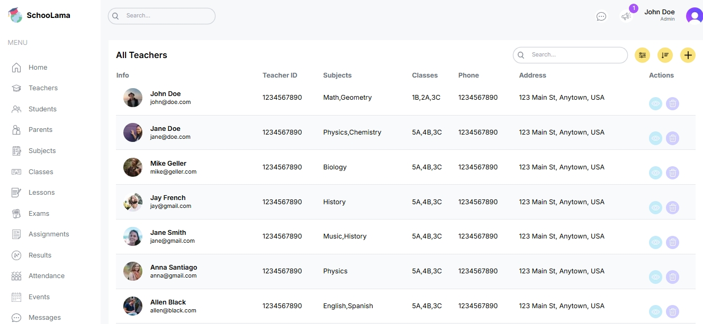
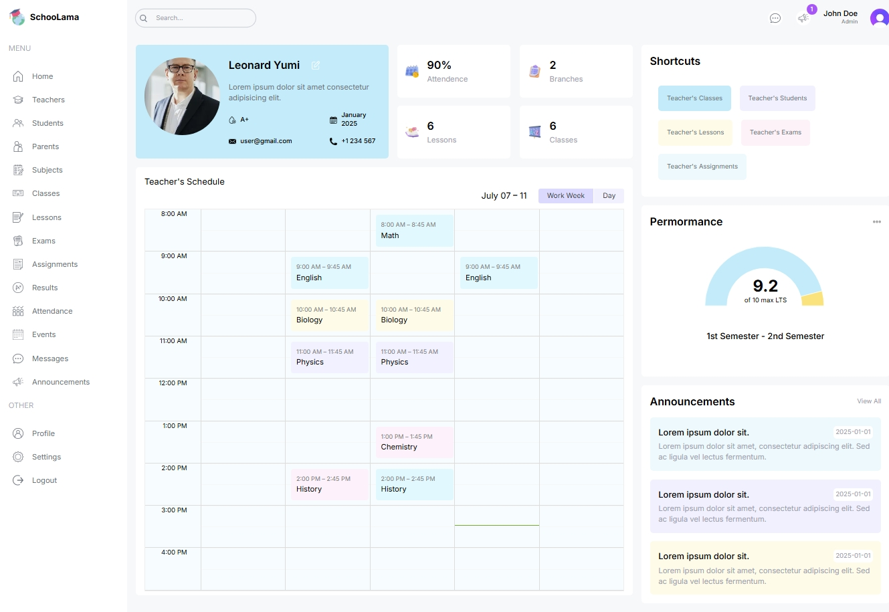
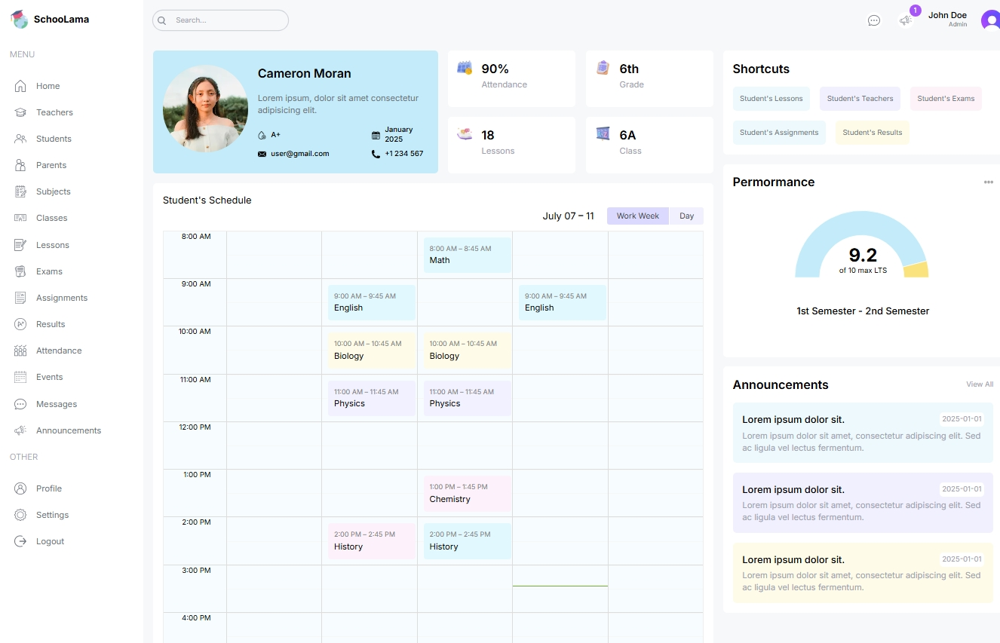
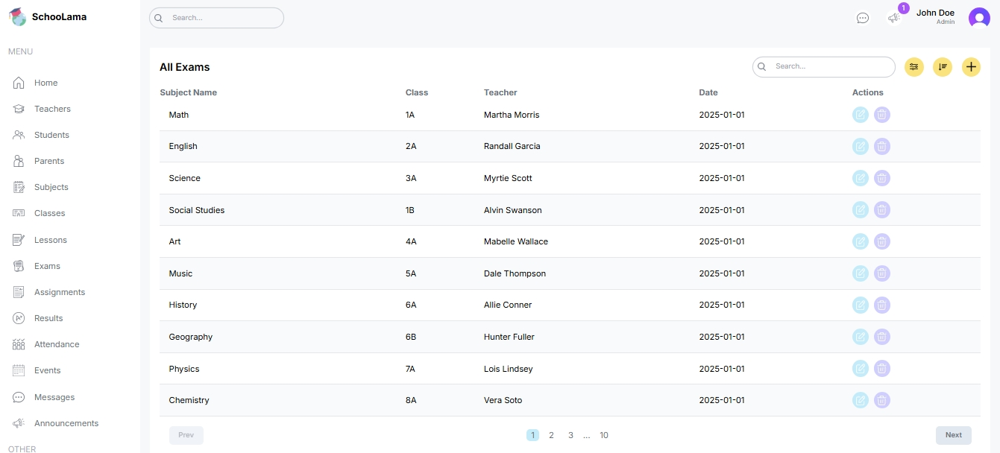

# Next.js School Management Dashboard (in progress)

This project is a school management dashboard built with Next.js and TypeScript. It includes features such as managing student, teachers and viewing their related exams & assigments. In addtion to adding anouncements, checking attendece, and more. It is supported with a rich UI
which includes tables and charts.

 

 

 

Besides using Next.js capabilities to implement this dashboard, I have included many modern js packeges in this project:

- **TypeScript** for type safety
- **TailwindCSS**
- **React-hook-form** and **Zod** for validating form
- **React-Calendar** and **React-Big-Calendar** for displaying beatiful caledars

I'm currently developing this dashboard to make it fetch real data using **Prisma** from **PostgeSQL** database already which I have deployed using **Docker**

You watch a live version of this project by clicking [here](https://m-mohammad25.github.io/ECommerce-App-with-React-TypeScript/)
